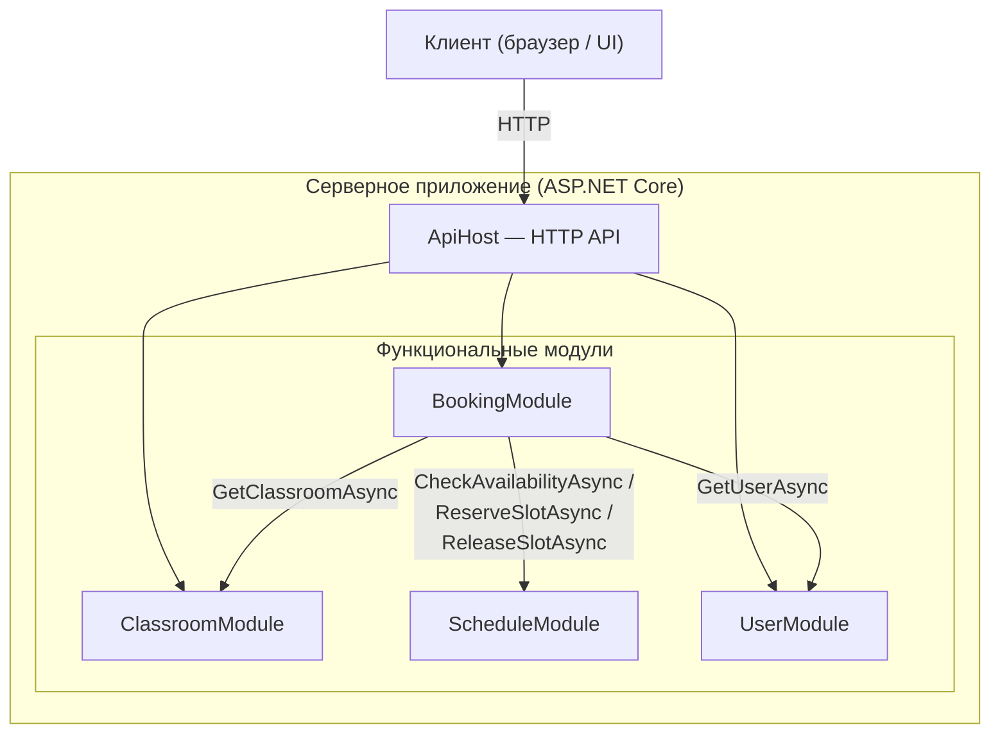

# Архитектурная схема

Для проекта выбрана модульная архитектура.

```mermaid
flowchart TD
    Client["Клиент (браузер / UI)"]
    subgraph Server["Серверное приложение (ASP.NET Core)"]
        ApiHost["ApiHost — HTTP API"]
        subgraph Modules["Функциональные модули"]
            Booking["BookingModule"]
            Classroom["ClassroomModule"]
            Schedule["ScheduleModule"]
            User["UserModule"]
        end
    end

    Client -->|HTTP| ApiHost
    ApiHost --> Booking
    ApiHost --> Classroom
    ApiHost --> User

    Booking -->|GetClassroomAsync| Classroom
    Booking -->|CheckAvailabilityAsync /<br/>ReserveSlotAsync /<br/>ReleaseSlotAsync| Schedule
    Booking -->|GetUserAsync| User
```