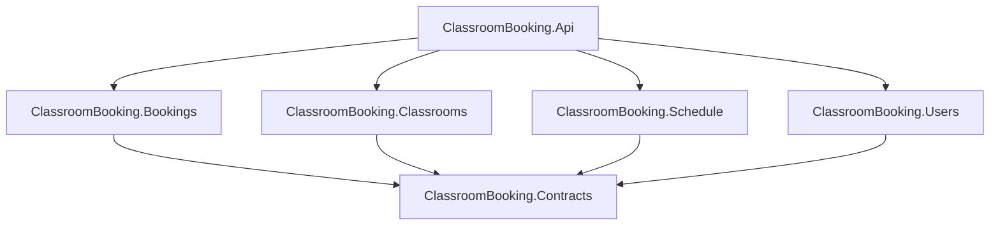

```mermaid
graph TD
    Api[ClassroomBooking.Api]
    Bookings[ClassroomBooking.Bookings]
    Classrooms[ClassroomBooking.Classrooms]
    Schedule[ClassroomBooking.Schedule]
    Users[ClassroomBooking.Users]
    Contracts[ClassroomBooking.Contracts]

    Api --> Bookings
    Api --> Classrooms
    Api --> Schedule
    Api --> Users

    Bookings --> Contracts
    Classrooms --> Contracts
    Schedule --> Contracts
    Users --> Contracts
```