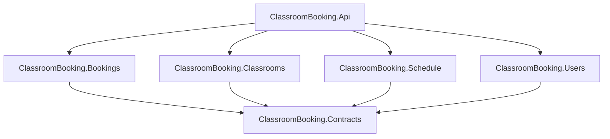

# Перечень зависимостей

## Внутренние зависимости

## Внешние зависимости

| Зависимость | Назначение |
| --- | --- |
| .NET 9 | Платформа выполнения |
| ASP.NET Core | Разработка серверного API |
| Entity Framework Core | Доступ к данным |
| SQLite | Хранение данных в учебной версии проекта |
| xUnit | Модульное тестирование |
| Git | Контроль версий |