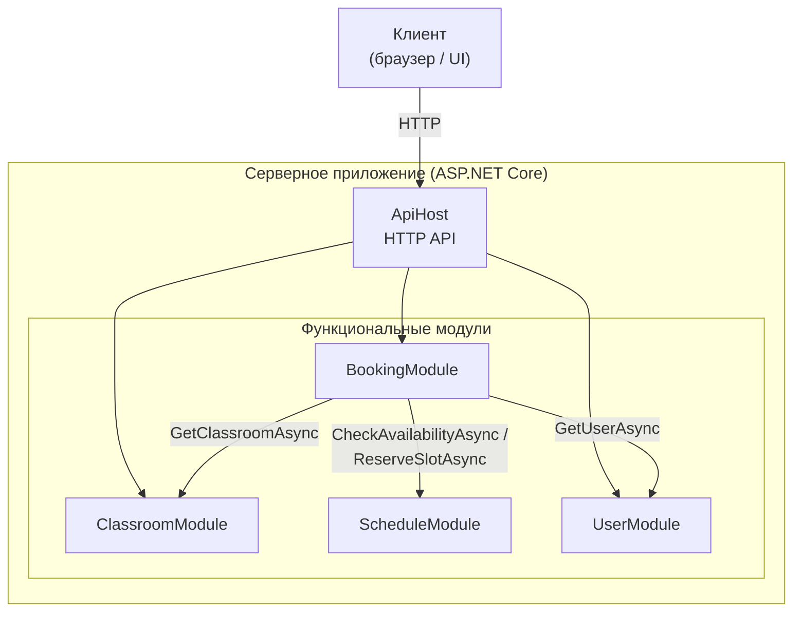
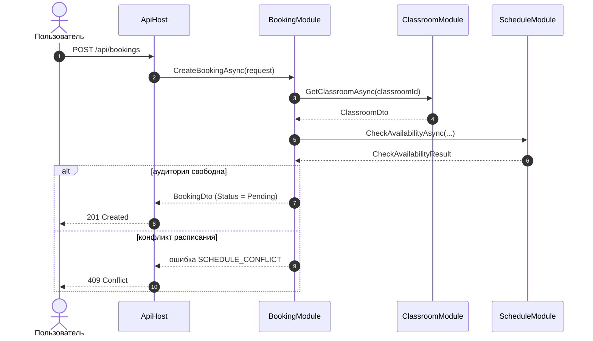

# Курсовое проектирование. Этап 1  
## Разработка перечня артефактов и протоколов проекта

**Тема курсового проекта:** «Бронирование учебных аудиторий»

**МДК:** 02.02 «Инструментальные средства разработки программного обеспечения»  
**Стек:** C# / .NET 9, Git  
**Тип приложения:** веб-приложение с серверной частью на ASP.NET Core

---

# 1. Исходное состояние проекта

Перед началом выполнения этапа был создан Git-репозиторий курсового проекта.

Исходное состояние было проверено командой:

```bash
git status
```

Текущая ветка:

```text
main
```

Для выполнения этапа создана отдельная ветка:

```bash
git checkout -b docs/project-artifacts
```

В рамках данного этапа выполняется проектирование структуры программной системы и подготовка проектной документации.

---

# 2. Назначение и границы проекта

## 2.1. Назначение системы

Разрабатываемая программная система предназначена для автоматизации аренды игровых приставок с доставкой клиенту.

Пользователь системы должен иметь возможность:

- просматривать список доступных аудиторий;
- просматривать расписание занятости аудиторий;
- выбирать временной интервал для бронирования;
- создавать заявку на бронирование;
- просматривать статус своих заявок;
- отменять свою заявку до её подтверждения.

Администратор сервиса должен иметь возможность:

- просматривать все заявки на бронирование;
- принимать (подтверждать) заявки на бронирование;
- отклонять заявки на бронирование;
- отменять подтверждённые бронирования;
- добавлять и изменять информацию об аудиториях;
- изменять состояние аудитории (доступна, на ремонте, зарезервирована).

---

## 2.2. Основные объекты предметной области

В системе выделены следующие основные сущности:

- пользователь (студент, преподаватель, администратор);
- учебная аудитория;
- заявка на бронирование;
- временной интервал;
- состояние аудитории;
- конфликт расписания.

Примеры типов аудиторий:

лекционная;
лабораторная;
семинарная;
компьютерный класс.

---

## 2.3. Границы проекта

### В систему входит

1. Ведение каталога учебных аудиторий
2. Проверка доступности аудитории на выбранный интервал
3. Создание заявки на бронирование
4. Проверка конфликтов расписания
5. Подтверждение или отклонение заявки администратором
6. Изменение состояния аудитории
7. Просмотр расписания занятости аудитории
8. Отмена бронирования
9. Хранение информации о пользователях
10. Просмотр истории бронирований

### В систему не входит

В рамках курсового проекта не реализуются:

- Интеграция с внешними системами расписания (1С, электронные журналы).
- Отправка уведомлений по электронной почте или SMS.
- Мобильное приложение.
- Интеграция с системами контроля доступа (электронные замки).
- Генерация отчётов и аналитика загрузки аудиторий.
- Многофилиальность (поддержка нескольких зданий/кампусов).
- Рекуррентное (повторяющееся) бронирование.

Эти функции могут быть добавлены при дальнейшем развитии проекта.

---

# 3. Реестр проектных артефактов

Для проекта сформирован следующий перечень артефактов.

| № | Артефакт | Назначение | Расположение |
|---:|---|---|---|
| 1 | Описание назначения и границ проекта | Определяет функции и ограничения системы | `docs/project-scope.md` |
| 2 | Перечень модулей | Описывает состав системы и ответственность модулей | `docs/modules.md` |
| 3 | Архитектурная схема | Показывает структуру и связи модулей | `docs/architecture.md` |
| 4 | Перечень зависимостей | Фиксирует внутренние и внешние зависимости | `docs/dependencies.md` |
| 5 | Контракты взаимодействия | Определяет правила обмена между модулями | `docs/contracts.md` |
| 6 | DTO | Определяет структуры передаваемых данных | `src/Contracts/` |
| 7 | Инструкция сборки и запуска | Позволяет другому разработчику запустить проект | `README.md` |
| 8 | Тестовая стратегия | Определяет порядок проверки системы | `docs/testing.md` |
| 9 | Правила работы с Git | Определяет правила ветвления и коммитов | `docs/version-control.md` |
| 10 | Журнал технических решений | Фиксирует значимые архитектурные решения | `docs/decisions/` |

---

# 4. Перечень модулей системы

В проекте выделено четыре основных функциональных модуля.

| Модуль | Ответственность |
|---|---|
| `ClassroomModule` | Хранение информации об учебных аудиториях и проверка их доступности |
| `BookingModule` | Создание и управление заявками на бронирование |
| `ScheduleModule` | Управление временными интервалами и предотвращение конфликтов расписания |
| `UserModule` | Хранение информации о пользователях и управление ролями |

Дополнительно используется `ApiHost`, который принимает запросы от пользовательского интерфейса и передает их соответствующим модулям.

---

## 4.1. ClassroomModule

Отвечает за каталог аудиторий.

Основные функции:

- получение списка аудиторий;
- получение информации об аудитории;
- проверка доступности на выбранный интервал;
- изменение состояния аудитории;
- фильтрация по типу, вместимости, оборудованию.

Пример состояний:

```text
Available - доступна для бронирования;
Reserved - зарезервирована (заявка подтверждена);
Maintenance - на обслуживании / ремонте;
Unavailable - временно недоступна.
```

---

## 4.2. BookingModule

Отвечает за процесс бронирования.

Основные функции:

- создание заявки на бронирование;
- проверка заявки администратором;
- подтверждение заявки;
- отклонение заявки;
- отмена бронирования;
- просмотр истории бронирований.

Модуль взаимодействует с:

```text
ClassroomModule;
ScheduleModule;
UserModule.
```

---

## 4.3. ScheduleModule

Отвечает за управление расписанием и предотвращение конфликтов.

Основные функции:

- проверка пересечения временных интервалов;
- получение расписания занятости аудитории;
- резервирование временного слота;
- освобождение временного слота;
- валидация корректности интервала.

Пример состояний:

```text
Free — свободен;
Pending — ожидает подтверждения;
Booked — забронирован;
Blocked — заблокирован (ремонт, мероприятие).
```

---

## 4.4. UserModule

Отвечает за работу с пользователями.

Основные функции:

- регистрация пользователя;
- аутентификация;
- получение данных пользователя;
- проверка роли пользователя;
- просмотр истории заявок пользователя.

Пример ролей:

- Student;
- Teacher;
- Admin.

---

# 5. Архитектурная схема

Для проекта выбрана модульная архитектура.



Центральным модулем бизнес-процесса является `BookingModule`.

При создании заявки на бронирование он:

1. получает данные пользователя;
2. проверяет существование и состояние аудитории;
3. проверяет конфликт расписания;
4. создаёт заявку;
5. передаёт заявку на рассмотрение администратору.

---

# 6. Предполагаемая структура решения

```text
classroom-booking-system/
│
├── src/
│   │
│   ├── ClassroomBooking.Api/
│   ├── ClassroomBooking.Classrooms/
│   ├── ClassroomBooking.Bookings/
│   ├── ClassroomBooking.Schedule/
│   ├── ClassroomBooking.Users/
│   └── ClassroomBooking.Contracts/
│
├── tests/
│   │
│   ├── ClassroomBooking.UnitTests/
│   └── ClassroomBooking.IntegrationTests/
│
├── docs/
│   │
│   ├── project-scope.md
│   ├── modules.md
│   ├── architecture.md
│   ├── dependencies.md
│   ├── contracts.md
│   ├── testing.md
│   ├── version-control.md
│   │
│   └── decisions/
│       ├── ADR-001-modular-architecture.md
│       └── ADR-002-module-contracts.md
│
├── .gitignore
├── .editorconfig
├── README.md
└── ClassroomBooking.sln
```

---

# 7. Внутренние зависимости

Внутренние зависимости определяют взаимодействие проектов внутри решения.

```text
Api
  ↓
 Booking
  ↓
 Contracts

Api
  ↓
 Classrooms
  ↓
 Contracts

Api
  ↓
 Schedule
  ↓
 Contracts

Api
  ↓
 Users
  ↓
 Contracts
```

При этом бизнес-модули не должны напрямую обращаться к внутренним классам друг друга.

Взаимодействие выполняется через публичные контракты.

Например:

```text
BookingModule
      ↓
IScheduleConflictService
      ↓
ScheduleModule
```

Это позволяет уменьшить связанность модулей.

---

# 8. Внешние зависимости

На этапе проектирования предполагается использование следующих внешних компонентов.

| Зависимость | Назначение |
|---|---|
| .NET 9 | Платформа выполнения |
| ASP.NET Core | Разработка серверного API |
| Entity Framework Core | Доступ к данным |
| SQLite | Хранение данных в учебной версии проекта |
| xUnit | Модульное тестирование |
| Git | Контроль версий |

Конкретные версии библиотек должны быть зафиксированы в файлах проекта.

---

# 9. Основные DTO проекта

Для передачи данных между слоями и модулями создаются DTO.

## 9.1. ClassroomDto

```csharp
public record ClassroomDto(
    Guid Id,
    string Name,
    string Building,
    int Capacity,
    string Type,
    string Status
);
```

---

## 9.2. CreateBookingRequest

```csharp
public record CreateBookingRequest(
    Guid UserId,
    Guid ClassroomId,
    DateTime StartTime,
    DateTime EndTime,
    string Purpose
);
```

---

## 9.3. BookingDto

```csharp
public record BookingDto(
    Guid Id,
    Guid UserId,
    Guid ClassroomId,
    DateTime StartTime,
    DateTime EndTime,
    string Purpose,
    string Status
);
```

---

## 9.4. CheckAvailabilityRequest

```csharp
public record CheckAvailabilityRequest(
    Guid ClassroomId,
    DateTime StartTime,
    DateTime EndTime
);
```

---

## 9.5. CheckAvailabilityResult

```csharp
public record CheckAvailabilityResult(
    bool IsAvailable,
    string? ErrorCode
);
```

---

## 9.6. ApproveBookingRequest

```csharp
public record ApproveBookingRequest(
    Guid BookingId,
    Guid AdminId
);
```

---

## 9.7. ScheduleSlotDto

```csharp
public record ScheduleSlotDto(
    Guid Id,
    Guid ClassroomId,
    DateTime StartTime,
    DateTime EndTime,
    string Status
);
```

---


## 9.8. UserDto

```csharp
public record UserDto(
    Guid Id,
    string FullName,
    string Email,
    string Role
);
```

---

# 10. Описание API

Клиентское приложение взаимодействует с системой через HTTP API.

Предполагаются следующие основные точки входа.

| Метод | Адрес | Назначение |
|---|---|---|
| `GET` | `/api/classrooms` | Получение списка аудиторий |
| `GET` | `/api/classrooms/{id}` | Получение информации об аудитории |
| `GET` | `/api/classrooms/{id}/schedule` | Получение расписания аудитории |
| `POST` | `/api/bookings` | Создание заявки на бронирование |
| `GET` | `/api/bookings/{id}` | Получение заявки |
| `GET` | `/api/bookings/user/{userId}` | Получение заявок пользователя |
| `POST` | `/api/bookings/{id}/approve` | Подтверждение заявки (админ) |
| `POST` | `/api/bookings/{id}/reject` | Отклонение заявки (админ) |
| `POST` | `/api/bookings/{id}/cancel` | Отмена бронирования |
| `GET` | `/api/users/{id}` | Получение данных пользователя |

Контракт API на последующих этапах может быть дополнительно описан средствами OpenAPI.

---

# 11. Протокол взаимодействия № 1  
## Резервирование игровой приставки

### 11.1. Инициатор и получатель

**Инициатор:**

```text
BookingModule
```

**Получатель:**

```text
ScheduleModule
```

---

### 11.2. Назначение

Протокол используется при создании заявки на бронирование. Перед сохранением заявки необходимо убедиться, что выбранная аудитория свободна на указанный временной интервал и конфликт расписания отсутствует.

---

### 11.3. Механизм вызова

Асинхронный вызов через интерфейс C#:

```csharp
IScheduleConflictService
```

Зависимость передается через механизм Dependency Injection.

---

### 11.4. Точка входа

```csharp
Task<CheckAvailabilityResult> CheckAvailabilityAsync(
    CheckAvailabilityRequest request,
    CancellationToken cancellationToken);
```

---

### 11.5. Формат запроса

```json
{
  "classroomId": "a3f1c8e2-5b7d-4e9a-8f2c-1d6e4a9b0c3f",
  "startTime": "2026-10-01T09:00:00",
  "endTime": "2026-10-01T10:30:00"
}
```

---

### 11.6. Успешный ответ

```json
{
  "isAvailable": true,
  "errorCode": null
}
```

---

### 11.7. Ошибки

Возможные ошибки:

| Код | Описание |
|---|---|
| `CLASSROOM_NOT_FOUND` | Аудитория не существует |
| `SCHEDULE_CONFLICT` | Аудитория занята на выбранный интервал |
| `INVALID_TIME_INTERVAL` | Некорректный временной интервал (конец раньше начала) |
| `CLASSROOM_UNAVAILABLE` | Аудитория недоступна (ремонт, обслуживание) |

Пример:

```json
{
  "isAvailable": false,
  "errorCode": "SCHEDULE_CONFLICT"
}
```

---

### 11.8. Таймаут

Операция должна завершиться не более чем за:

```text
3 секунды
```

При отмене запроса используется `CancellationToken`.

---

### 11.9. Повторная отправка

Автоматический повтор операции проверки не выполняется.
Причина: повторный вызов может вернуть иной результат, если за время между вызовами расписание изменилось. 

Повтор выполняется только при явной необходимости с повторной проверкой результата.

---

### 11.10. Аутентификация

Дополнительная аутентификация между модулями не выполняется, поскольку они работают внутри одного серверного приложения.

Проверка прав пользователя выполняется на уровне API.

---

### 11.11. Версия контракта

```text
ScheduleConflictContract v1
```

---

### 11.12. Пример обмена

```text
BookingModule
       │
       │ CheckAvailabilityAsync(...)
       ▼
 ScheduleModule
       │
       │ Проверка существования аудитории
       │
       │ Проверка пересечения интервалов
       │
       │ Проверка состояния аудитории
       ▼
 CheckAvailabilityResult
       │
       ▼
 BookingModule
```

При отсутствии конфликта `BookingModule` продолжает создание заявки.

При ошибке `SCHEDULE_CONFLICT` заявка не создаётся, пользователю возвращается информация о конфликте.

---

# 12. Протокол взаимодействия № 2  
## Подтверждение заявки на бронирование администратором

### 12.1. Инициатор и получатель

**Инициатор:**

```text
BookingModule
```

**Получатель:**

```text
ScheduleModule
```

---

### 12.2. Назначение

После того как администратор подтверждает заявку на бронирование, необходимо зарезервировать временной слот в расписании аудитории, чтобы предотвратить бронирование этого же интервала другими пользователями.

---

### 12.3. Механизм вызова

Асинхронный вызов через интерфейс:

```csharp
IScheduleReservationService
```

---

### 12.4. Точка входа

```csharp
Task<ScheduleSlotDto> ReserveSlotAsync(
    ReserveSlotRequest request,
    CancellationToken cancellationToken);
```

---

### 12.5. Формат запроса

```json
{
  "bookingId": "7c9e6679-7425-40de-944b-e07fc1f90ae7",
  "classroomId": "a3f1c8e2-5b7d-4e9a-8f2c-1d6e4a9b0c3f",
  "startTime": "2026-10-01T09:00:00",
  "endTime": "2026-10-01T10:30:00"
}
```

---

### 12.6. Успешный ответ

```json
{
  "id": "d290f1ee-6c54-4b01-90e6-d701748f0851",
  "classroomId": "a3f1c8e2-5b7d-4e9a-8f2c-1d6e4a9b0c3f",
  "startTime": "2026-10-01T09:00:00",
  "endTime": "2026-10-01T10:30:00",
  "status": "Booked"
}
```

---

### 12.7. Ошибки

| Код | Описание |
|---|---|
| `BOOKING_NOT_FOUND` | Заявка не существует |
| `SLOT_ALREADY_RESERVED` | Слот уже зарезервирован другой заявкой |
| `INVALID_TIME_INTERVAL` | Некорректный временной интервал |
| `CLASSROOM_NOT_FOUND` | Аудитория не найдена |

Пример ошибки:

```json
{
  "success": false,
  "errorCode": "SLOT_ALREADY_RESERVED"
}
```

---

### 12.8. Таймаут

Максимальное ожидаемое время выполнения:

```text
3 секунды
```

---

### 12.9. Повторная отправка

Повторный запрос допускается только после проверки того, что слот для данной заявки ещё не зарезервирован. 

`BookingId` используется для предотвращения создания нескольких резервирований по одной заявке.

---

### 12.10. Аутентификация

Внутренняя аутентификация между модулями не требуется. 

Доступ к операции подтверждения заявки предварительно проверяется на уровне API (проверка роли Admin).

---

### 12.11. Версия контракта

```text
ScheduleReservationContract v1
```

---

### 12.12. Пример обмена

```text
BookingModule
      │
      │ ReserveSlotAsync(...)
      ▼
ScheduleModule
      │
      │ Проверка данных
      │
      │ Проверка доступности слота
      │
      │ Создание записи в расписании
      ▼
ScheduleSlotDto
      │
      ▼
BookingModule
```

---

# 13. Общий сценарий создания заказа

После определения двух протоколов полный процесс бронирования выглядит следующим образом:



Результатом операции является подтверждённое бронирование с зарезервированным временным слотом в расписании аудитории.

---

# 14. Инструкция сборки и запуска

## Требования

Для запуска проекта необходимы:

- .NET SDK 9;
- Git.

Проверка версии .NET:

```bash
dotnet --version
```

---

## Получение проекта

```bash
git clone https://github.com/u-Kotovsky/classroom-booking-system
cd classroom-booking-system
```

---

## Восстановление зависимостей

```bash
dotnet restore
```

---

## Сборка

```bash
dotnet build
```

---

## Выполнение тестов

```bash
dotnet test
```

---

## Запуск

```bash
dotnet run --project src/classroom-booking-system.Api
```

После запуска API становится доступно по адресу, указанному приложением в консоли.

---

# 15. Тестовая стратегия

Для проекта предусматриваются три уровня проверки.

## 15.1. Модульные тесты

Модульные тесты должны проверять отдельные правила предметной области.

Примеры:

### Тест 1

Аудитория свободна на указанный интервал

**Ожидаемый результат:** Проверка возвращает `IsAvailable = true`

### Тест 2

Аудитория занята на пересекающийся интервал

**Ожидаемый результат:** Возвращается `SCHEDULE_CONFLICT`

### Тест 3

Время окончания раньше времени начала

**Ожидаемый результат:** Возвращается `INVALID_TIME_INTERVAL`

### Тест 4

Аудитория находится в состоянии Maintenance

**Ожидаемый результат:** Возвращается `CLASSROOM_UNAVAILABLE`

### Тест 5

Заявка создаётся с корректными данными

**Ожидаемый результат:** Статус заявки = Pending


### Тест 6

Подтверждение заявки администратором

**Ожидаемый результат:** Статус меняется на `Approved`, слот резервируется

---

## 15.2. Интеграционные тесты

Интеграционные тесты должны проверять взаимодействие модулей.

### Сценарий 1. Успешное создание и подтверждение заявки

```text
BookingModule
    ↓
ScheduleModule (проверка)
    ↓
BookingModule
    ↓
ScheduleModule (резервирование)
```

Ожидается:

- конфликт не обнаружен;
- заявка создана;
- слот зарезервирован;
- статус заявки = `Approved`.

### Сценарий 2. Конфликт расписания

Ожидается:

- проверка обнаруживает пересечение;
- заявка не создаётся;
- пользователю возвращается ошибка `SCHEDULE_CONFLICT`.


### Сценарий 3. Отмена бронирования

Ожидается:

- статус заявки меняется на `Cancelled`;
- слот освобождается;
- аудитория снова доступна для бронирования.

---

## 15.3. Проверка сборки

После внесения изменений должны выполняться:

```bash
dotnet build
dotnet test
```

Критерием успешного результата является отсутствие ошибок сборки и прохождение всех автоматических тестов.

---

# 16. Правила ведения репозитория

Для проекта используются следующие основные ветки:

```text
main
develop
feature/*
fix/*
docs/*
```

## main

Содержит стабильную версию проекта.

## develop

Используется для объединения результатов разработки.

## feature/*

Используется для разработки новых функций.

Примеры:

```text
feature/booking-creation
feature/classroom-catalog
feature/schedule-conflict-check
```

## fix/*

Используется для исправления дефектов.

Например:

```text
fix/time-validation
```

## docs/*

Используется при значительных изменениях документации.

Например:

```text
docs/project-artifacts
```

---

# 17. Правила коммитов

Один коммит должен содержать одно логически завершенное изменение.

Используются следующие обозначения:

```text
feat: новая функциональность
fix: исправление
docs: документация
test: тесты
refactor: изменение структуры кода
chore: техническое изменение
```

Примеры:

```text
docs: add project scope
docs: add architecture diagram
docs: describe module contracts
feat: add booking DTOs
feat: implement schedule conflict check
test: add booking validation tests
```

Не допускаются малоинформативные сообщения:

```text
update
fix
work
123
изменения
```

---

# 18. Журнал технических решений

Для значимых решений проекта используется каталог:

```text
docs/decisions/
```

Каждое решение оформляется отдельным документом.

---

## ADR-001. Использование модульной архитектуры

### Статус

Принято.

### Проблема

Необходимо разделить функции системы таким образом, чтобы изменение логики расписания не приводило к изменению модуля аудиторий или управления пользователями.

### Решение

Разделить приложение на функциональные модули:

```text
Classrooms
Bookings
Schedule
Users
```

### Причина

Такое разделение позволяет:

- определить ответственность компонентов;
- уменьшить связанность;
- независимо тестировать бизнес-логику;
- упростить последующее расширение проекта.

---

## ADR-002. Взаимодействие через контракты

### Статус

Принято.

### Проблема

Прямое обращение одного модуля к внутренним классам другого увеличивает связанность приложения.

### Решение

Взаимодействие модулей выполнять через публичные интерфейсы и DTO.

Например:

```text
BookingModule
        ↓
IScheduleConflictService
        ↓
ScheduleModule
```

### Последствия

Положительные:

- модули слабее связаны;
- проще выполнять тестирование;
- контракт взаимодействия можно изменить контролируемо.

Отрицательные:

- необходимо поддерживать дополнительные DTO и интерфейсы.

---

# 19. Проверка выполнения этапа

После подготовки проектных артефактов была выполнена самопроверка.

| Требование | Результат |
|---|---|
| Описано назначение проекта | Выполнено |
| Определены границы проекта | Выполнено |
| Выделены модули | Выполнено |
| Описана ответственность модулей | Выполнено |
| Подготовлена архитектурная схема | Выполнено |
| Определены внутренние зависимости | Выполнено |
| Определены внешние зависимости | Выполнено |
| Описан API | Выполнено |
| Созданы модели DTO | Выполнено |
| Описаны минимум два протокола | Выполнено |
| Подготовлена инструкция запуска | Выполнено |
| Подготовлена тестовая стратегия | Выполнено |
| Определены правила Git | Выполнено |
| Создан журнал технических решений | Выполнено |

---

# 20. Изменения в репозитории

В рамках этапа были созданы следующие документы:

```text
docs/project-scope.md
docs/modules.md
docs/architecture.md
docs/dependencies.md
docs/contracts.md
docs/testing.md
docs/version-control.md
docs/decisions/ADR-001-modular-architecture.md
docs/decisions/ADR-002-module-contracts.md
README.md
```

Также были подготовлены модели контрактов в:

```text
src/ClassroomBooking.Contracts/
```

---

# 21. Пример истории Git

В ходе выполнения этапа изменения разделялись на логические коммиты.

```text
docs: describe project scope
docs: add modules and architecture
docs: describe module dependencies
docs: add rental and delivery contracts
docs: add testing strategy
docs: add version control rules
docs: add architecture decisions
```

После завершения этапа выполняется:

```bash
git status
```

Репозиторий не должен содержать незакоммиченных изменений.

---

# 22. Что было получено в результате этапа

В результате выполнения этапа:

- определено назначение системы бронирования учебных аудиторий;
- установлены границы проекта;
- выделены четыре основных функциональных модуля;
- сформирована архитектурная схема;
- описаны внутренние и внешние зависимости;
- определены основные DTO;
- определены точки входа API;
- разработан протокол проверки доступности аудитории и предотвращения конфликтов расписания;
- разработан протокол резервирования временного слота при подтверждении заявки;
- определена тестовая стратегия;
- определены правила ведения Git-репозитория;
- зафиксированы основные архитектурные решения.

---

# 23. Оставшиеся риски

На данном этапе выявлены следующие риски.

### Риск 1. Одновременное бронирование

Два пользователя могут попытаться забронировать одну аудиторию на одинаковый интервал. 
На этапе реализации необходимо обеспечить защиту от одновременного бронирования (оптимистичная или пессимистичная блокировка).

### Риск 2. Ошибка после проверки доступности

Аудитория может быть свободна на момент проверки, но к моменту подтверждения заявки слот может быть занят. 
Необходимо предусмотреть повторную проверку при подтверждении.

### Риск 3. Отмена без освобождения слота

При отмене бронирования временной слот должен быть гарантированно освобождён. 

Необходимо обеспечить атомарность операции отмены.

### Риск 4. Изменение контрактов

При изменении DTO необходимо контролировать совместимость взаимодействующих модулей.

---

# 24. Вывод

В рамках первого этапа курсового проектирования была сформирована проектная основа системы бронирования учебных аудиторий.

Определены назначение и границы системы, состав функциональных модулей, их ответственность и зависимости. Разработана архитектурная схема приложения, определены основные DTO и точки входа API.

Подробно описаны два протокола взаимодействия: проверка доступности аудитории и предотвращение конфликта расписания между модулем бронирования и модулем расписания, а также резервирование временного слота при подтверждении заявки администратором.

Также подготовлены инструкция сборки и запуска, тестовая стратегия, правила ведения Git-репозитория и журнал значимых технических решений.

Созданная документация позволяет перейти к следующим этапам разработки и использовать зафиксированные контракты при реализации и интеграции программных модулей
