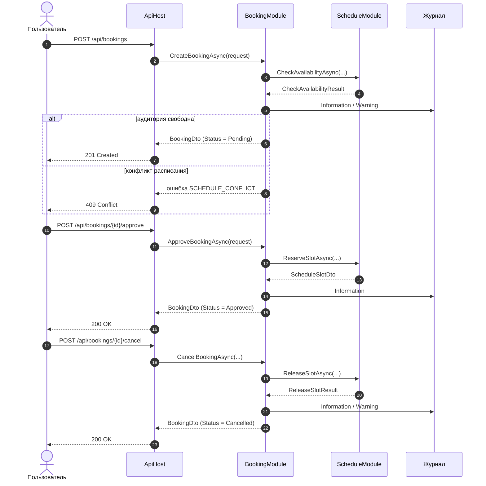

# Отчёт по этапу 3. Разработка и интеграция модулей проекта

## 1. Проверяемый результат

В рамках этапа 3 выполнены разработка и интеграция минимум двух взаимодействующих модулей системы бронирования учебных аудиторий.

Интегрируемые модули:

- `BookingModule`;
- `ScheduleModule`.

Интеграция выполнена через заранее зафиксированные контракты:

- `IScheduleConflictService`;
- `IScheduleReservationService`;
- `IScheduleReleaseService`.

## 2. Рабочая ветка

Работа выполнялась в отдельной ветке:

```text
feature/stage3-module-integration
```

Слияние результатов выполнялось в ветку:

```text
develop
```

## 3. Схема потока данных



## 4. Успешный сценарий интеграционной границы

Операция:

```text
Создание заявки на бронирование при свободной аудитории
```

Условия:

- временной интервал корректен;
- пересечений с существующими слотами нет.

Ожидаемый результат:

- `CheckAvailabilityAsync` возвращает `IsAvailable = true`;
- заявка создаётся со статусом `Pending`;
- в журнале фиксируется операция `CreateBooking` со значением `Result = Success`.

Проверяющий тест:

```text
BookingScheduleIntegrationTests.CreateBooking_WhenSlotFree_ReturnsPendingAndLogsSuccess
```

## 5. Отрицательный сценарий интеграционной границы

Операция:

```text
Создание заявки на бронирование при занятом временном интервале
```

Условия:

- на запрашиваемый интервал уже существует зарезервированный слот.

Ожидаемый результат:

- `CheckAvailabilityAsync` возвращает `IsAvailable = false`;
- возвращается ошибка `SCHEDULE_CONFLICT`;
- заявка не создаётся;
- в журнале фиксируется операция `CheckAvailability` со значением `Result = Rejected` и `ErrorCode = SCHEDULE_CONFLICT`.

Проверяющий тест:

```text
BookingScheduleIntegrationTests.CreateBooking_WhenSlotBusy_ReturnsScheduleConflictAndLogsWarning
```

## 6. Журналирование с контекстом

Для интеграционной границы используются следующие операции:

| Операция | Модуль | Успешный результат | Ошибка |
| --- | --- | --- | --- |
| CheckAvailability | ScheduleModule | Information | Warning |
| ReserveSlot | ScheduleModule | Information | Warning / Error |
| ReleaseSlot | ScheduleModule | Information | Warning / Error |
| CreateBooking | BookingModule | Information | Warning / Error |
| ApproveBooking | BookingModule | Information | Warning / Error |
| CancelBooking | BookingModule | Information | Warning / Error |

Минимальный контекст записи журнала:

```text
Operation, Result, BookingId, ClassroomId, StartTime, EndTime, ErrorCode
```

## 7. Тесты

Добавлены модульные тесты:

```text
ScheduleServiceTests.CheckAvailabilityAsync_WhenNoOverlap_ReturnsAvailable
ScheduleServiceTests.CheckAvailabilityAsync_WhenEndTimeBeforeStartTime_ReturnsInvalidTimeInterval
ScheduleServiceTests.CheckAvailabilityAsync_WhenSlotReserved_ReturnsScheduleConflict
```

Добавлены интеграционные тесты:

```text
BookingScheduleIntegrationTests.CreateBooking_WhenSlotFree_ReturnsPendingAndLogsSuccess
BookingScheduleIntegrationTests.CreateBooking_WhenSlotBusy_ReturnsScheduleConflictAndLogsWarning
BookingScheduleIntegrationTests.ApproveBooking_ReservesSlotAndChangesStatusToApproved
BookingScheduleIntegrationTests.CancelBooking_ReleasesSlotAndChangesStatusToCancelled
```

## 8. Результаты проверки

После слияния рабочей ветки этапа 3 выполнены команды:

```bash
dotnet build
dotnet test
```

Ожидаемый результат:

- сборка завершается без ошибок;
- все автоматические тесты проходят.

Фактический вывод команд вставляется после выполнения проверки:

```text
Вставить вывод dotnet build
```

```text
Вставить вывод dotnet test
```

## 9. Найденные интеграционные проблемы и способ устранения

| Проблема | Влияние | Способ устранения | Статус |
| --- | --- | --- | --- |
| Отсутствовала явная сигнатура интерфейсов в контрактах | Риск расхождения реализаций модулей | Добавлен раздел `14. Интерфейсы служб контрактов` | Устранено на уровне контракта |
| В протоколе освобождения слота была опечатка | Снижение качества документации | Исправлено слово `belongs` на `принадлежит` | Устранено |
| Не было автоматической проверки успешного сценария интеграции | Невозможно подтвердить работоспособность границы модулей | Добавлен интеграционный тест `CreateBooking_WhenSlotFree_ReturnsPendingAndLogsSuccess` | Требует подтверждения запуском тестов |
| Не было автоматической проверки отрицательного сценария | Риск пропуска конфликта расписания | Добавлен интеграционный тест `CreateBooking_WhenSlotBusy_ReturnsScheduleConflictAndLogsWarning` | Требует подтверждения запуском тестов |
| Журналирование не имело единого контекста | Затруднена диагностика межмодульных ошибок | Добавлен документ `docs/logging.md` с обязательными полями контекста | Устранено на уровне политики |
| Риск одновременного бронирования одной аудитории | Два запроса могут пройти проверку доступности до резервирования | При реализации резервирования использовать блокировку на уровне слота или транзакции БД, повторная проверка при подтверждении | Требует подтверждения на этапе промышленной реализации |
| Риск изменения контрактов без контроля совместимости | Модули могут перестать взаимодействовать корректно | Версии контрактов зафиксированы: `ScheduleConflictContract v1`, `ScheduleReservationContract v1`, `ScheduleReleaseContract v1` | Устранено на уровне контракта |

## 10. Вывод

Этап 3 считается выполненным после подтверждения следующих фактов:

- реализованы минимум два взаимодействующих модуля;
- интеграция выполнена через зафиксированный контракт;
- добавлены успешный и отрицательный сценарии проверки;
- добавлено журналирование с контекстом;
- добавлены модульный и интеграционный тесты;
- после слияния выполнены `dotnet build` и `dotnet test`;
- в отчёте приведена схема потока данных;
- зафиксированы найденные интеграционные проблемы и способы устранения.